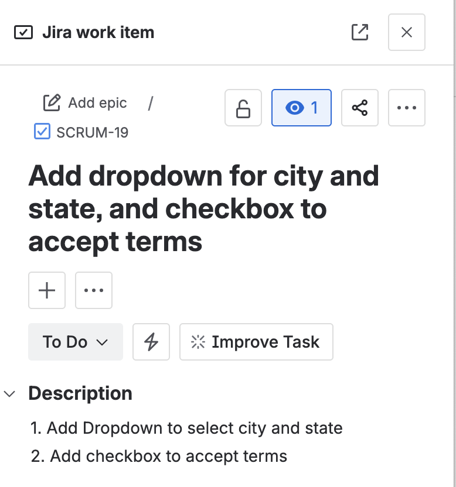
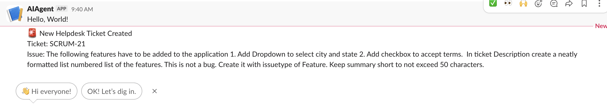
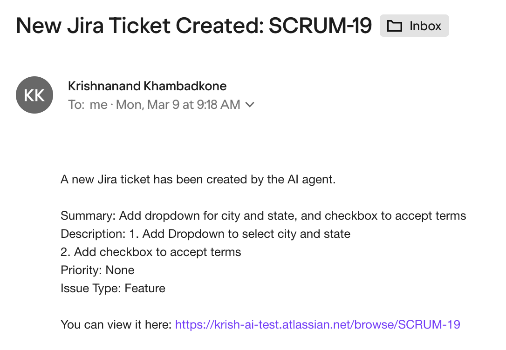

# AI Helpdesk Agent (LangGraph + MCP)

An **AI-powered helpdesk agent** that automatically analyzes user-reported issues using an LLM and performs automated incident management actions such as:

* Creating **Jira tickets**
* Sending **email notifications**
* Posting **Slack alerts**

The agent uses **Llama3 via Ollama** to understand problem descriptions and determine the appropriate **priority** and **issue type**, then orchestrates the resulting actions through **MCP (Model Context Protocol) servers** wired together with a **LangGraph StateGraph**.

---

# Features

* 🧠 **AI-powered issue classification**
* 🎟️ **Automatic Jira ticket creation** via Atlassian's hosted MCP server
* 📨 **Email notification to support teams** via a custom local MCP server
* 💬 **Slack alerts for real-time monitoring** via Slack's hosted MCP server
* ⚡ **Fully automated helpdesk workflow**, with email/Slack notifications fanning out in parallel
* 🔔 **Demonstrates 2-shot and chain-of-thought prompting**
* 🔗 **Demonstrates LangChain + LangGraph + MCP together**
* 🧪 **Mock mode** — exercise the full graph with zero live credentials

---

# Architecture

```
Problem
   ↓
classify (LLM, chain-of-thought prompt)
   ↓
resolve_cloud_id (Atlassian MCP)
   ↓
create_ticket (Atlassian MCP)
   ↓
 ┌────────────┬────────────┐
 ▼            ▼            ▼
(none)   notify_email   notify_slack
             (MCP)         (MCP)
```

The AI agent analyzes the issue and automatically decides:

* Issue **priority** (Low, Medium, High)
* Issue **type** (Bug, Task, Story)
* Whether to send **email notifications**
* Whether to send **Slack alerts**

Jira and Slack are both accessed through their official **hosted** MCP servers — remote, OAuth-based, nothing to install or run locally for either. Email has no equivalent off-the-shelf MCP server, so this project includes a small custom one (`email_mcp_server.py`) that runs locally.

---

# Example Workflow

**Input:**

```
Production website is down and users cannot log in.
```

**AI Decision:**

```
Priority: High
Issue Type: Bug
Slack Alert: Yes
Email Notification: Yes
```

**Actions Performed:**

```
1. Jira ticket created
2. Email notification sent
3. Slack alert posted
```


**Input:**

```
Create a product selection page where users can choose:
 - Product category from a dropdown
 - Product brand from a dropdown
 - Delivery speed using radio buttons
 - Warranty option using radio buttons
```

**AI Decision:**

```
Priority: Medium 
Issue Type: Story 
Slack Alert: No 
Email Notification: No 
```

**Actions Performed:**

```
1. Jira ticket created
```

---

# Files

* `helpdesk_agent_mcp_langgraph.py` — main orchestrator
* `email_mcp_server.py` — local MCP server wrapping SMTP send-mail (no off-the-shelf email MCP server exists, so this one is custom-built for the project)
* `requirements.txt` — dependencies

---

# Requirements

* Python 3.10+
* Ollama
* Jira Cloud account
* Slack workspace
* SMTP email account

Install dependencies:

```
pip install -r requirements.txt
```

Installs: `langchain[mcp]` (>=1.4.0), `langchain-ollama`, `langgraph`, `pydantic`, `fastmcp`.

MCP support here uses the built-in `langchain.mcp` namespace (which wraps FastMCP), not the older standalone `langchain-mcp-adapters` package — that package doesn't perform OAuth for remote servers and will get a 401 against Atlassian/Slack's hosted MCP endpoints. `langchain.mcp.MCPAdapter` with `auth="oauth"` handles the full OAuth 2.1 flow (discovery, dynamic client registration, browser consent) automatically.

No Node.js or `npx` is required — both Jira and Slack are accessed through their official hosted MCP servers.

---

# Running the LLM

Install Ollama and run Llama3 locally.

Install Ollama:

https://ollama.com

Pull the model:

```
ollama pull llama3
```

Start the Ollama service.

---

# Jira Configuration

The agent talks to **Atlassian's official Rovo MCP server** (`https://mcp.atlassian.com/v1/sse`), authenticated via `langchain.mcp.MCPAdapter`'s `auth="oauth"` (FastMCP's OAuth 2.1 client: discovery, dynamic client registration, and a browser consent step, automatically).

* No API token or bearer token is stored in the script.
* The agent calls `getAccessibleAtlassianResources` at the start of each run to resolve your Atlassian **cloudId**, then passes that into `createJiraIssue`.
* Set the project key as an environment variable:

```
export JIRA_PROJECT_KEY="SCRUM"
export JIRA_SITE_URL="https://your-domain.atlassian.net"
```

* First run opens a browser for OAuth consent. Tokens are cached in an encrypted local store (`~/.helpdesk-agent/oauth-tokens`), so subsequent runs reuse them instead of reopening the browser — see "Persisting OAuth Tokens" below.
* **Still to confirm:** the exact required/optional fields `createJiraIssue` expects (in particular, whether `description` needs to be pre-formatted as Atlassian Document Format rather than plain text) — check `tool.args_schema` after calling `adapter.list_tools()`.
* **Known past failure mode:** an earlier version of this project pointed a config dict directly at the SSE URL with no `auth` at all, which sends an unauthenticated request and gets a `401 Unauthorized` from Atlassian. If you see that error, confirm you're on the `langchain.mcp.MCPAdapter` + `auth="oauth"` path described above, not a bare URL config.

---

# Slack Configuration

Slack ships its own first-party remote MCP server, hosted at `https://mcp.slack.com/mcp`, generally available since February 17, 2026. It's remote and OAuth 2.1-based — but unlike Atlassian's server, **it does not support Dynamic Client Registration (DCR)**. Auto-registration (`auth="oauth"`) fails against it with something like:

```
RuntimeError: Client failed to connect: Registration failed: 302
(redirected to https://mcp-<id>.slack.com/register; not followed)
```

This is a known limitation of Slack's MCP server, not specific to this project — the same failure has been reported against other MCP clients (Cursor, Claude Code) connecting to `mcp.slack.com`. The fix is a **pre-registered OAuth app** instead of DCR:

1. Create an app at https://api.slack.com/apps → "From scratch"
2. Open **Agents & AI Apps** in the sidebar and toggle on **Model Context Protocol**
3. Open **OAuth & Permissions** → under Redirect URLs, add exactly:

```
http://127.0.0.1:8732/callback
```

   (`8732` matches `SLACK_OAUTH_CALLBACK_PORT` in the script — change both together if you need a different port)

4. Add the User Token Scopes your MCP use case needs
5. Install/approve the app for your workspace, then copy the **Client ID** (and **Client Secret**, if using a confidential app) from Basic Information
6. Set:

```
export SLACK_MCP_CLIENT_ID="your-client-id"
export SLACK_MCP_CLIENT_SECRET="your-client-secret"   # omit for a public/PKCE-only app
export SLACK_CHANNEL_ID="C0XXXXXXX"
```

* First run still opens a browser for consent, but authenticates against your pre-registered app instead of attempting DCR. Tokens are cached the same way as Jira's — see "Persisting OAuth Tokens" below.

(There is also a locally-run alternative — `@modelcontextprotocol/server-slack` — but it's Anthropic's archived reference server: an early local server configured with Slack bot tokens, no longer patched. A maintained community alternative, korotovsky/slack-mcp-server, self-hosted via npx or Docker, exists if a local deployment is ever preferred over the hosted one. This project uses the official hosted server.)

---

# Persisting OAuth Tokens

By default, FastMCP's `OAuth` helper holds tokens in memory only — since each run of the script is a fresh Python process, that meant every single run re-triggered the browser consent flow for both Jira and Slack. This project instead uses an encrypted, on-disk token store shared by both, so consent only needs to happen once.

* Requires `py-key-value-aio[disk]` and `cryptography` (already in `requirements.txt`). Disk-backed storage is an opt-in extra in FastMCP 3+, after a CVE in the underlying `diskcache` package.
* Tokens are written to `~/.helpdesk-agent/oauth-tokens/`, encrypted with a key kept at `~/.helpdesk-agent/oauth-key`.
* The encryption key is generated automatically on first run if `OAUTH_STORAGE_ENCRYPTION_KEY` isn't set. To pin it explicitly instead (e.g. to back it up, or share it across machines):

```
export OAUTH_STORAGE_ENCRYPTION_KEY="$(python3 -c 'from cryptography.fernet import Fernet; print(Fernet.generate_key().decode())')"
```

* Losing the key file just means re-authenticating on the next run — it only protects the local token cache, not your Jira/Slack accounts themselves.
* Delete `~/.helpdesk-agent/` entirely to force fresh consent for both services (e.g. after changing scopes).

---


SMTP settings are supplied as environment variables and consumed by `email_mcp_server.py`:

```
export SMTP_SERVER="smtp.gmail.com"
export SMTP_PORT="587"
export EMAIL_USER="your_email@gmail.com"
export EMAIL_PASS="your_app_password"
export NOTIFY_EMAIL_TO="support-team@example.com"
```

`EMAIL_PASS` must be a Gmail **App Password** (requires 2-Step Verification enabled on the account), not your normal Gmail login password.

---

# Running the Email MCP Server in the Background (nohup)

Of the three MCP servers, **email is the only local process** — Jira and Slack are both remote/hosted, so there's nothing to background for either of those.

In the live (non-mock) configuration, `helpdesk_agent_mcp_langgraph.py` launches `email_mcp_server.py` itself as a subprocess over stdio — you don't normally start it separately. If you want it running persistently in the background instead (e.g. to test it standalone, or reuse it across multiple orchestrator runs), use `nohup`:

```
nohup python email_mcp_server.py > email_mcp_server.log 2>&1 &
```

* `nohup` keeps the process alive after the terminal session ends
* `> email_mcp_server.log 2>&1` redirects stdout/stderr to a log file, since the server doesn't print anything during normal operation
* `&` backgrounds it

Check it's running:

```
ps aux | grep email_mcp_server.py
```

Stop it:

```
kill <pid>
```

**Resolved:** OAuth tokens for Atlassian and Slack are now cached to an encrypted local store rather than held in memory — see "Persisting OAuth Tokens" above. Both connections should only need browser consent once, not on every run.

---

# Running the Program

Mock mode — exercises the full LangGraph flow with no live Jira/Slack/email credentials, using stubbed tool responses:

```
USE_MOCKS=true python helpdesk_agent_mcp_langgraph.py
```

Live mode — requires all of the Jira, Slack, and email configuration above to be set:

```
USE_MOCKS=false python helpdesk_agent_mcp_langgraph.py
```

Enter the problem description at the prompt and press Enter twice to submit:

```
Describe the problem: The following features have to be added to the application 1. Add Dropdown to select city and state 2. Add checkbox to accept terms. In ticket Description create a neatly formatted list numbered list of the features. This is not a bug. Create it with issuetype of Feature. Keep summary short to not exceed 50 characters.
```

**Still missing:** no worked example output for this version yet (a transcript showing the AI decision, ticket creation, and notification results end to end), and no example screenshots for the LangGraph flow.

---

# Example Output

Analyzing issue using AI...

AI Decision: {'priority': 'Low', 'issue_type': 'Feature', 'needs_slack': True, 'needs_email': False}
{'id': '10094', 'key': 'SCRUM-21', 'self': 'https://krish-ai-test.atlassian.net/rest/api/3/issue/10094'}
Jira ticket created: SCRUM-21
Slack notification sent

*(Console formatting shown above is from the earlier direct-API script — the LangGraph version prints a `final_state` dict instead — but the resulting Jira ticket, Slack message, and email are identical regardless of which implementation created them, so the screenshots below still apply.)*

---
## Example Jira Ticket




## Example Slack channel notification



## Example Email 
                      


---

# Future Enhancements

Possible improvements:

* Retrieval-Augmented Generation (RAG) using a **vector database**
* Incident knowledge base with **ChromaDB**
* Root cause suggestions based on historical incidents
* Automated remediation actions
* Integration with monitoring tools

---

# Technologies Used

* Python
* Ollama
* Llama3
* LangChain
* LangGraph
* MCP (Model Context Protocol) — Atlassian Rovo MCP server, Slack MCP server, custom email MCP server
* SMTP Email

---

# License

MIT License

---

# Author

Krishnanand Khambadkone

AI / Data / Cloud Enthusiast
